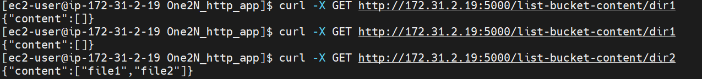

# OneN_project:
Prerequisite: 
    1. Temporary EC2 instance with teraform installation
    2. create IAM user with permission for EC2 and s3 full access
    3. copy Terraform directory on Temporary EC2 instance.
    4. replace variable value as per your requirnment 
   
Terraform:
terraform init
terraform plan
terraform apply -auto-approve

#login to created EC2 instance
#copy One2N_http_app
cd One2N_http_app
#run deploy.sh
#this script will install docker,create container and run application in it
bash deploy.sh

